SRA Alignment Pipeline
======
## Table of Contents
- [Introduction](#introduction)
- [Installation](#installation)
- [Input Data](#input-data)
- [Output Data](#output-data)
- [Pipeline Overview](#pipeline-overview)
- [Pipeline Graph](#pipeline-graph)
- [Usage](#usage)
  - [Usage Examples](#usage-examples)
  - [Test the Pipeline](#test-the-pipeline)
  - [Post-Run Cleanup and Archiving](#post-run-cleanup-and-archiving)
  - [Reproducibility and Docker Images](#reproducibility-and-docker-images)
- [Contributing Guidelines](#contributing-guidelines)
- [License](#license)
  - [Third-Party Software](#third-party-software)
  - [Disclaimer](#disclaimer)

## Introduction
- This nextflow pipeline is designed to simplify the process of aligning sequence data from the Sequence Read Archive (SRA) to a reference genome from NCBI Nucleotide. 
- It automates the process of downloading data, performing quality control, aligning sequences, and calling variants. 
- You can learn more about these databases by following these links: [SRA](https://www.ncbi.nlm.nih.gov/sra/docs/) and [NCBI Nucleotide](https://www.ncbi.nlm.nih.gov/books/NBK49541/). 

## Installation
**Important:** Before you can use this pipeline, you need to install Nextflow and Docker. 
- Nextflow can be installed by following the instructions [here](https://www.nextflow.io/docs/latest/getstarted.html). 
- Docker can be installed by following the instructions [here](https://docs.docker.com/get-docker/). 
- This pipeline has been tested with Nextflow version 22.10.7 and 23.04.0 and Docker version 20.10.24 on both arm64 and x86 architectures.

## Input Data

The pipeline accepts input data in two ways:

1. **Command Line**: You can provide SRA accession numbers and NCBI identifiers directly via command line.
2. **CSV File**: Alternatively, you can provide a CSV file with SRA accession numbers in the first column and NCBI identifiers in the second column.

Please note the following:

- Any SRA accession type can be used (SRR/ERR/DRR, SRX/ERX/DRX, SRP/ERP/DRP, etc.).
- For accessions with multiple SRRs, the given identifier will be associated with all SRRs (up to a maximum of 20).
- If you need to extract more than 20 SRRs from a given SRA accession, please use [SRA-Explorer](https://sra-explorer.info/) or other appropriate tools.
- To find an appropriate NCBI reference genome identifier, visit [NCBI Nucleotide](https://www.ncbi.nlm.nih.gov/nuccore) and perform a search like: "organism_name"[Organism] AND genome[All Fields].

If both command line and CSV inputs are provided, the pipeline defaults to the CSV. The pipeline requires either command line or CSV input to run.

**Important**: You must provide an [NCBI](https://account.ncbi.nlm.nih.gov/signup/?back_url=https%3A%2F%2Fwww.ncbi.nlm.nih.gov%2Fsra) registered email address to run this pipeline. Providing an email address is required when accessing NCBI services that this pipeline depends on.


## Output Data
The pipeline produces several types of output data, including quality control reports, alignment files, and variant calling results. These files are stored in the `results` directory. See the [Test the Pipeline](#test-the-pipeline) for an example of the output files generated by this pipeline.

## Pipeline Overview
The pipeline uses several different open-source packages, including:

| Process(es) | Package(s) | Description | Official Link | GitHub Repository or Documentation | Version |
| --- | --- | --- | --- | --- | --- |
| `download_fasta` | **Biopython, Pysam** | These are used in the `download_fasta` process to fetch a reference genome sequence from NCBI, writing it to a FASTA file, and then compressing the file using pysam's `tabix_compress` function. | [Biopython](https://biopython.org/), [Pysam](https://pysam.readthedocs.io/en/latest/) | [Biopython](https://github.com/biopython/biopython), [Pysam](https://github.com/pysam-developers/pysam) | biopython:1.81, pysam:0.21.0 |
| `download_fastq` | **aria2** | The `download_fastq` process uses aria2 to download fastq.gz files associated with a given SRR via ftp from ENA. aria2 splits each fastq.gz file into three parts to improve download speeds. | [aria2](https://github.com/aria2/aria2) | [aria2](https://aria2.github.io/) | aria2:1.35.0 |
| `run_fasterq_dump` | **prefetch, fasterq-dump** | The `run_fasterq_dump` process uses `prefetch` to download the .sra file associated with the SRR accession and then `fasterq-dump` to extracts reads from the .sra file in FastQ format, splitting the reads into forward and reverse reads while skipping technical reads. **Note:** this package only runs if the fastq_download fails. | [SRA Toolkit](https://www.ncbi.nlm.nih.gov/sra/docs/) | [SRA Toolkit](https://github.com/ncbi/sra-tools) | sra-tools:3.0.1 |
| `run_pigz` | **pigz** | The `run_pigz` process uses pigz (parallel gzip) to compress the fastq files from fasterq-dump. **Note:** this package only runs if the fastq_download fails. | [pigz](https://zlib.net/pigz/) | [pigz](https://github.com/madler/pigz) | pigz:2.6-1 |
| `run_fastp` | **fastp** | The `run_fastp` process uses fastp to perform quality control and preprocessing of FastQ files. It trims the raw reads and generates cleaned up forward and reverse reads. The `run_fastp` process also outputs a report showing sequence quality and other statistics before and after trimming.| [Fastp](https://opengene.org/) | [Fastp](https://github.com/OpenGene/fastp) | fastp:0.23.3 |
| `run_bowtie2` | **Bowtie2** | The `run_bowtie2` process uses bowtie2 to align the cleaned-up sequence reads to the reference genome downloaded earlier. `run_bowtie2` also generates alignment statistics and files for both mapped and unmapped reads. | [Bowtie2](https://bowtie-bio.sourceforge.net/bowtie2/manual.shtml) | [Bowtie2](https://github.com/BenLangmead/bowtie2) | bowtie2:2.5.1 |
| `run_samtools` | **Samtools** | The `run_samtools` uses samtools to convert the alignment file from `run_bowtie2` from SAM to BAM and then sorts the BAM file. Additionally, samtools indexes the BAM file and the reference genome. | [Samtools](http://www.htslib.org/doc/samtools.html) | [Samtools](https://github.com/samtools/samtools) | samtools:1.17 |
| `run_bcftools`, `run_bcftools_filter` | **Bcftools** | Bcftools is used in two distinct ways in this pipeline. Initially, in the `run_bcftools` process, Bcftools is employed for calling variants, generating consensus sequences, and producing statistical data and plots associated with the variant calling. Subsequently, in the `run_bcftools_filter` process, Bcftools filters variants based on inclusion or exclusion criteria provided by the user, generating filtered VCF files, statistics, and plots. If neither --include or --exclude options are provided by the user, then the filtering step will be skipped. | [Bcftools](http://www.htslib.org/doc/bcftools.html) | [Bcftools](https://github.com/samtools/bcftools) | bcftools:1.17 |
| `run_qualimap` | **Qualimap** | The `run_qualimap` process uses qualimab to produce a quality control report for the sorted BAM file produced by samtools. | [Qualimap](http://qualimap.conesalab.org/) | [Qualimap](http://qualimap.conesalab.org/doc_html/index.html) | qualimap:2.2.1 |


## Pipeline Graphs
Generated using -with-dag option in Nextflow and [Mermaidv10.2.2 Live Editor](https://mermaid.live/edit#pako:eNpVjk2Lg0AMhv9KyGkL9Q94WGh1t5fCFurN6SFo7AztfDBGpKj_fcd62c0pvM_zhkzY-JYxx-7px0ZTFKhK5SDNoS50NL1Y6m-QZZ_ziQWsd_ya4fhx8tBrH4Jx993mH1cJium8agyijXssGyre_R_HM5T1mYL4cPtLqtHP8FWbi07n_xMdObW-647yjrKGIhQU3wru0XK0ZNr0_rQmCkWzZYV5WlvuaHiKQuWWpNIg_vpyDeYSB97jEFoSLg3dI9ktXH4B_cJWqw)

**Input_File Graph**
***


**CLI_Input Graph**
***



## Usage
```
nextflow run https://github.com/eoksen/sra_alignment_pipeline -r main [OPTIONS] OR nextflow run main.nf [OPTIONS]

OPTIONS:
--cpus <int> The number of CPUs you want to use for processing, default: 2. We recommend allocating as many cores as possible to speed up analysis. 

--email <ncbi-email-address> Your email address registered with NCBI, required.

--architecture <arm64 or x86_64> The architecture of your system, required to pull the correct Docker image for your system.

--sra_accession <SRR#> The accession number of the SRA run you want to process, required if no input_file given.

--identifier <id#> The identifier of the reference genome you want to align to, required if no input_file given.

--input_file <path> Path to input file. Takes a CSV file with two columns: column 1: sra_accession, column 2: identifier, required if no --sra_accession given.

--include <expressions> or --exclude <expressions> A filter to apply to the variant calling process. This should be a string with the filtering criteria in single quotes, like 'DP>200'. More information about this function can be found at bcftools filter manual and the allowed expressions for this filter can be found here. If you do not want to filter the variants, you can leave this parameter blank.

--ploidy <int> The ploidy of the organism you are analyzing, default: 1.

--L <int> Parameter for bowtie2, from the bowtie2 documentation: "Sets the length of the seed substrings to align during multiseed alignment. Smaller values make alignment slower but more sensitive." The default value is 22. The seed length must be smaller than the read length." Default: 22. For more info, check out the official bowtie2 link above.

--X <int> Parameter for bowtie2, from the bowtie2 documentation:"The maximum fragment length for valid paired-end alignments. E.g. if -X 100 is specified and a paired-end alignment consists of two 20-bp alignments in the proper orientation with a 60-bp gap between them, that alignment is considered valid (as long as -I is also satisfied). A 61-bp gap would not be valid in that case. If trimming options -3 or -5 are also used, the -X constraint is applied with respect to the untrimmed mates, not the trimmed mates." Default: 600 For more info, check out the official bowtie2 link above.
```

## Usage Examples
### **Option #1: Run from Github**
To run with sra_accession and identifier provided on the cli, execute the following command in your terminal
```bash
nextflow run https://github.com/eoksen/sra_alignment_pipeline -r main --sra_accession <SRR> --identifier <ncbi-id> --cpus <int> --email <ncbi-email-address> --architecture <arm64 or x86_64> 
```
To run with an input file, execute the following command in your terminal
```bash
nextflow run https://github.com/eoksen/sra_alignment_pipeline -r main --input_file <path/to/input/file.csv> --cpus <int> --email <ncbi-email-address> --architecture <arm64 or x86_64> 
```

### **Option #2: Clone repo from Github to your local environment**
You can clone the repo using either by HTTPS:
```bash
git clone https://github.com/eoksen/sra_alignment_pipeline.git
``` 
or, if using GitHub CLI:
```bash
gh repo clone eoksen/sra_alignment_pipeline  
```
To run with sra_accession and identifier provided on the cli, execute the following command in your terminal at the root of the cloned repo:

```bash
nextflow run main.nf --sra_accession <SRR> --identifier <ncbi-id> --cpus <int> --email <ncbi-email-address> --architecture <arm64 or x86_64>
```
To run with an input file, execute the following command in your terminal at the root of the cloned repo:
```bash
nextflow run main.nf --input_file <path/to/input/file.csv> --cpus <int> --email <ncbi-email-address> --architecture <arm64 or x86_64> 
```

## Test the Pipeline
Two input files are provided in the `test_data` directory. To run the pipeline on the test data, execute the following command in your terminal at the root of the cloned repo:
```bash
nextflow run main.nf --input_file test_data/test1/test1.csv --cpus <int> --email <ncbi-email-address> --architecture <arm64 or x86_64> 
```

For this file, process execution should look like:


and the results directory should contain the following files:


## Post-Run Cleanup and Archiving

After each run of the pipeline, your working directory may become cluttered with output files. To help manage these files, we provide a cleanup and archiving script: archive_nf.sh. This script:

- Keeps your workspace organized.
- Makes it easier to find and review the output of specific runs.

You can find the script at scripts/archive_nf.sh. To run the script after a Nextflow run, use the following command:

```bash
scripts/archive_nf.sh
```

Or you can run the pipeline and the script in one command:
```bash
nextflow run main.nf --input_file test_data/test1.csv --cpus <int> --email <ncbi-email-address> --architecture <arm64 or x86_64> && scripts/archive_nf.sh
```
This command will:

- Create a new subdirectory in the nextflow_archive directory.
- Name the subdirectory run_YYYYMMDD_HHMMSS, where YYYYMMDD is the current date and HHMMSS is the current time.
- Move the work directory, .nextflow directory, .nextflow.log file, and any dangling .nextflow.log* files to this new subdirectory.

Before running the script, make sure it has execution permissions. You can give it execution permissions with the following command:
```bash
chmod +x scripts/archive_nf.sh
```
Remember to run the script from the same directory where you ran the Nextflow pipeline.

## Reproducibility and Docker Images

To ensure that the results of this pipeline can be reliably reproduced, we run all processes for this pipeline in Docker containers with versioned software. The Docker images used by the pipeline are all available on Docker Hub. The names and tags for each image can be found in its individual nextflow process. For example, the `run_fastp` process uses the eoksen/fastp:v0.23.3 image. You can find this image on Docker Hub here.

However, if you wish to build these Docker images on your own system, you can do so using the Dockerfiles and scripts provided in the dockerfiles directory. To build all of these images, you can use the scripts/build_images.sh script. This script will:

- Build both architecture versions for each package under the same tag with buildx.
- For bowtie2, build a separately tagged version for each architecture.

You can run the `build_images.sh` script with the following command:
```bash
scripts/build_images.sh
```
Before running the script, make sure it has execution permissions. You can give it execution permissions with the following command:
```bash
chmod +x scripts/build_images.sh
```

## Contributing Guidelines

We welcome and appreciate contributions from the community! Here's how you can contribute:

### **Reporting Issues**

If you find a bug or have a suggestion for a new feature, please [open a new issue](https://github.com/eoksen/sra_alignment_pipeline/issues). When reporting a bug, please include as much information as possible, including:

- The version of Nextflow you're using
- The operating system you're running on
- The exact command you ran
- Any error messages you received

### **Contributing Code**

We welcome contributions of code, whether it's fixing a bug or implementing a new feature. Here's how you can contribute code:

1. Fork the repository and create a new branch for your changes.
2. Make your changes in your branch. If you're adding a new feature, please include notes about what inputs you have tested so we can replicate that behavior and conduct other tests before pulling.
3. Once you're done with your changes, [open a pull request](https://github.com/eoksen/sra_alignment_pipeline/pulls). Please include a clear description of the changes you made and the rationale behind them.

### **Questions**

If you have any questions about contributing to this project, please feel free to [open a new issue](https://github.com/eoksen/sra_alignment_pipeline/issues) or contact the project maintainers.

Thank you for your interest in contributing to our project!


## License

This project is licensed under the terms of the GNU General Public License v3.0. For the full text of the license, see the [LICENSE.txt](https://github.com/eoksen/sra_alignment_pipeline/LICENSE.txt) file.

### **Third-Party Software**

This project includes and depends on various third-party software components. Each of these components is licensed under its own terms, which can be found in the corresponding Dockerfile in the `root/dockerfiles/image_name` directory for each Docker image used in this project.

By using this project, you acknowledge that you understand and will comply with all relevant licenses for these third-party components.

### **Disclaimer**

THE SOFTWARE IS PROVIDED "AS IS", WITHOUT WARRANTY OF ANY KIND, EXPRESS OR IMPLIED, INCLUDING BUT NOT LIMITED TO THE WARRANTIES OF MERCHANTABILITY, FITNESS FOR A PARTICULAR PURPOSE AND NONINFRINGEMENT. IN NO EVENT SHALL THE AUTHORS OR COPYRIGHT HOLDERS BE LIABLE FOR ANY CLAIM, DAMAGES OR OTHER LIABILITY, WHETHER IN AN ACTION OF CONTRACT, TORT OR OTHERWISE, ARISING FROM, OUT OF OR IN CONNECTION WITH THE SOFTWARE OR THE USE OR OTHER DEALINGS IN THE SOFTWARE.
